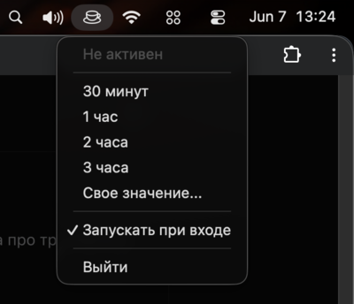
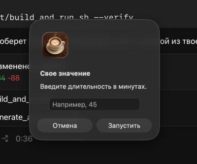

# Caffeine

A small macOS menu bar app that keeps your Mac awake for a selected amount of time.

[Русская версия](README.md)

## What It Is

`caffeinate` is a separate macOS CLI utility. It already exists in macOS and can temporarily prevent your Mac from sleeping.

`Caffeine` does not replace `caffeinate`. It is a lightweight menu bar user interface for it: an icon, quick timers, custom duration, status, and remaining time.

## Screenshots

<p>
  
  
  
</p>

## Features

- Runs from the macOS menu bar.
- Starts and stops the system `caffeinate` command.
- Quick timers: 30 minutes, 1 hour, 2 hours, and 3 hours.
- Custom duration in minutes.
- Shows active or inactive state in the menu bar icon.
- Shows remaining time while active.
- Can register itself as a Login Item to start when you sign in.
- Uses a bundled coffee cup app icon.

## Download The App

Download the compiled app from Releases:

[Download Caffeine.app](https://github.com/ZhdanDesign/caffeine-tray/releases/latest/download/Caffeine.zip)

Unzip the archive and launch `Caffeine.app`.

## Requirements For Building From Source

- macOS 13 or later.
- Xcode Command Line Tools.
- ImageMagick, used by the build script to generate the `.icns` app icon.

Install ImageMagick with Homebrew:

```bash
brew install imagemagick
```

## Build And Run

```bash
./script/build_and_run.sh
```

The script builds the SwiftPM executable, creates `dist/Caffeine.app`, generates the app icon from `Resources/coffe-icon.png`, and launches the app bundle.

To verify that the app launches:

```bash
./script/build_and_run.sh --verify
```

## Usage

Open the menu bar icon and choose a timer:

- `30 минут`
- `1 час`
- `2 часа`
- `3 часа`
- `Свое значение...`

Use `Деактивировать` to stop the active `caffeinate` process.

## License

MIT
